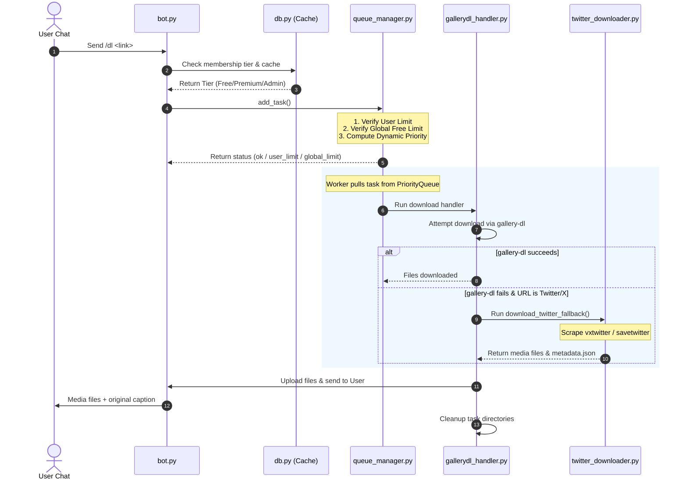

# SpideyBot Project Documentation

SpideyBot is a high-performance, asynchronous Telegram bot built with **Telethon** that allows users to download media from **TeraBox** shared links and hundreds of other websites supported by **gallery-dl** and **yt-dlp** (including Twitter/X, Instagram, TikTok, YouTube, Reddit, etc.).

---

## 📂 Project Directory Structure

The codebase is organized as a structured Python package (`spideybot`) to separate concern areas, prevent code duplication, and ensure maintainability:

```text
MyBot/
├── .devcontainer/              # VS Code remote development container config
├── .vscode/                    # VS Code task runner configurations
├── data/                       # Local directory (mounted to container for SQLite DB)
├── downloads/                  # Temporary downloads directory (ignored in Git & Docker)
├── spideybot/                  # Main package folder
│   ├── __init__.py             # Package initializer
│   ├── __main__.py            # Allows package execution (python -m spideybot)
│   ├── bot.py                  # Telethon event handlers (Telegram client lifecycle)
│   ├── config.py               # Centralized configuration, env validation & constants
│   ├── db.py                   # SQLite database manager (User caching & tiers)
│   ├── queue_manager.py        # Asynchronous priority queue & scheduling logic
│   └── downloaders/            # Extraction and download handlers
│       ├── __init__.py
│       ├── gallerydl_downloader.py# gallery-dl downloader class wrapper
│       ├── gallerydl_handler.py# Gallery-dl extraction & file pipeline
│       ├── terabox_downloader.py# TeraBox API resolver & downloader class
│       ├── terabox_handler.py   # TeraBox download & execution pipeline
│       └── twitter_downloader.py# Custom Twitter/X extraction API fallbacks
├── .dockerignore               # Patterns excluded from Docker build context
├── .gitignore                  # Git untracked pattern file
├── Dockerfile                  # Multi-stage image build (Python + Deno + FFmpeg)
├── docker-compose.yml          # Container service definition & volume mapping
├── gallery-dl.json             # Autogenerated/merged configurations for gallery-dl
├── main.py                     # Root entry point wrapper
├── requirements.txt            # Python package dependencies
├── yt-dlp.conf                 # Global yt-dlp options (for gallery-dl backend)
└── Summary.md                  # This file (Project Summary)
```

---

## ⚙️ Core Architecture & Components

### 1. Root Entry Wrapper (`main.py` & `spideybot/__main__.py`)
* Serves as the package entry point.
* Delegates execution to the main event loop in `spideybot/bot.py`.

### 2. Configuration Manager (`spideybot/config.py`)
* Loads environment variables from `.env` using `python-dotenv`.
* Validates required API keys and parses configuration values (e.g. download limits, admin IDs).
* centralizes helper functions, such as size formatting and URL validation.

### 3. Database Manager (`spideybot/db.py`)
* Backed by a local **SQLite** database (`data/db.sqlite3`).
* Tracks user subscriptions (Free, Premium, Admin) and expiry dates.
* Implements an **in-memory cache** for user tiers to eliminate disk reads during heavy user interaction (rate limit checks).

### 4. Queue Manager (`spideybot/queue_manager.py`)
* Implements an asynchronous worker pool (`asyncio.PriorityQueue`).
* Manages the active worker tasks (`MAX_CONCURRENT_DOWNLOADS`).
* **Cumulative Free Safeguard**: Restricts total cumulative concurrent downloads for Free users (`MAX_CONCURRENT_FREE_TOTAL`) to prevent them from locking up the worker pool.
* **Fair Share Scheduling (QoS)**: Uses dynamic task priority calculations based on the user's active counts:
  $$\text{Priority} = \text{Tier Base} + (\text{Active User Count} \times 0.1)$$
  * Premium Base: `1.0` | Free Base: `2.0`
  * This guarantees that a Premium user with 0 active downloads will skip ahead of a Premium user who is already running 4 downloads.

### 5. Download Handlers (`spideybot/downloaders/`)
* **`terabox_handler.py`**: Resolves TeraBox shared links via the `TeraBoxDownloader` module, handles pagination/tree directories, and uploads them to Telegram.
* **`gallerydl_handler.py`**: Invokes the `gallery-dl` CLI tool in a subprocess. It monitors downloaded folder sizes in real-time during execution; if a download exceeds the user's tier size limit, it terminates the subprocess immediately to save system bandwidth.
* **`twitter_downloader.py`**: Handles Twitter/X URLs. If `gallery-dl` fails (e.g., due to rate-limiting or login requirements), this custom fallback module executes. It attempts `vxtwitter` JSON API first to extract direct media CDN links and the tweet caption, and falls back to `savetwitter.net` HTML scraping if needed.

---

## 🔄 End-to-End Download Workflow



---

## 🐳 Dockerization & Deployment

SpideyBot is fully dockerized to ensure that external CLI tools (like `Deno` and `FFmpeg`, which are required by `gallery-dl` and `yt-dlp`) are always present and correctly configured.

### Persistence & Storage
* **SQLite Database**: Mounted via host volume to `/app/data` to persist user subscriptions across container restarts.
* **gallery-dl Cache**: Mounted to a named Docker volume (`gallery-dl-cache`) mapped to `/root/.gallery-dl` to persist authentication and OAuth tokens (e.g., Reddit OAuth).
* **`.dockerignore`**: Excludes local environment variables (`*.env`), database folder (`**/data`), downloads directory, and Telethon session files (`*.session`) from being baked into the built image layers to maintain security and reduce image footprint.

### Running with Docker Compose
1. Ensure your environment variables are configured in `.env` (the simplified `TERABOX_COOKIE="ndus=..."` avoids Docker Compose parsing conflicts).
2. Start the service in the background:
   ```bash
   docker compose up -d --build

---

## Changelog

- 2026-06-22: Renamed environment variables `REDDIT_CLIENT_ID` -> `REDDIT_GDL_CLIENT_ID` and `REDDIT_REFRESH_TOKEN` -> `REDDIT_GDL_REFRESH_TOKEN`. Updated `spideybot/config.py`, `spideybot/downloaders/gallerydl_downloader.py`, `.env`, and `.env.example` to use the new names and fallback logic.
   ```
